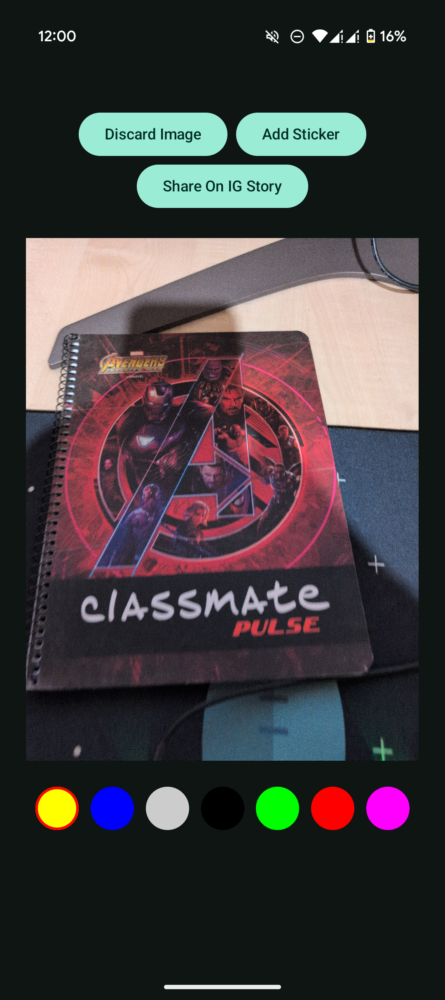
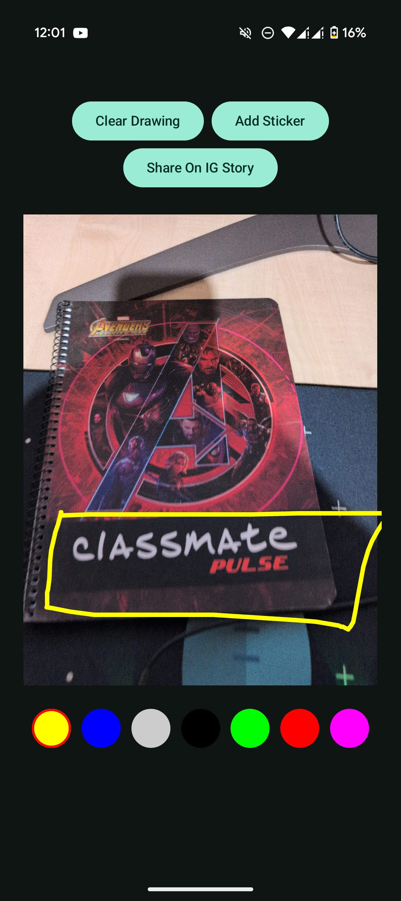
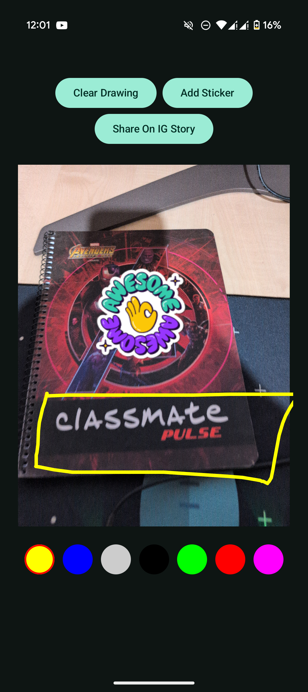
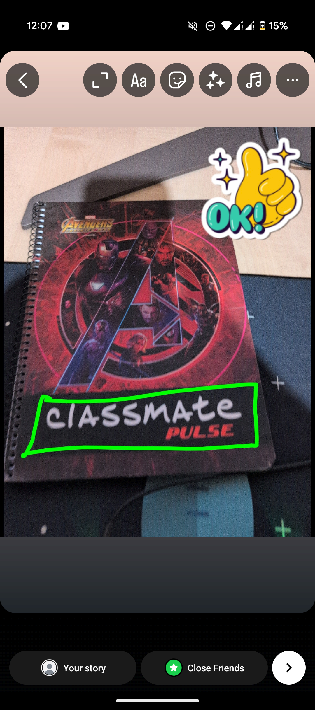
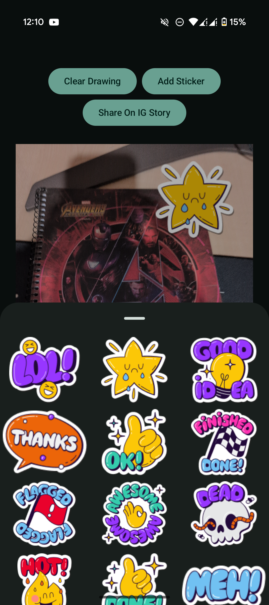

StoryCraft

**StoryCraft** is a simple Android app for creating and sharing stories.

## Getting Started

1. Clone the repository: `git clone https://github.com/your-username/storycraft.git`
2. Open the project in Android Studio.
3. Build and run the app.

## Features

- Capture image from camera.
- Draw/Annotated on the image
- Add sticker on the image
- Share these drawing directly on pentagram story.

## Screenshots

| Take photo from camera                 | Draw on the photo                      | Add stickers                            | Share on story                         |
|----------------------------------------|----------------------------------------|-----------------------------------------|----------------------------------------|
|  |  | < |  |
|                                        |                                        |   |                                        |

